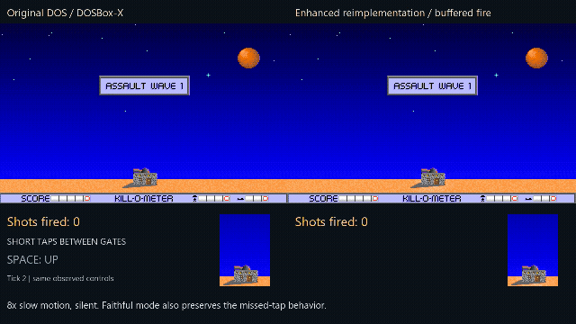
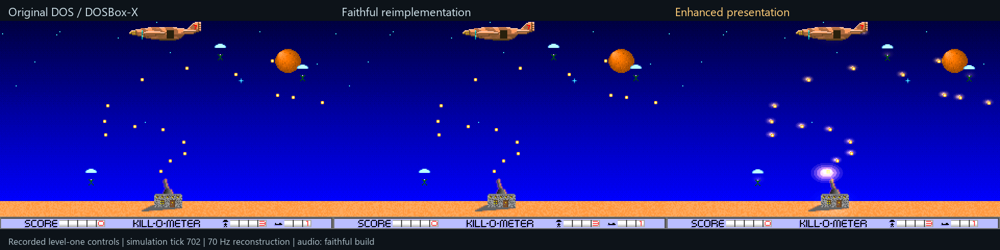
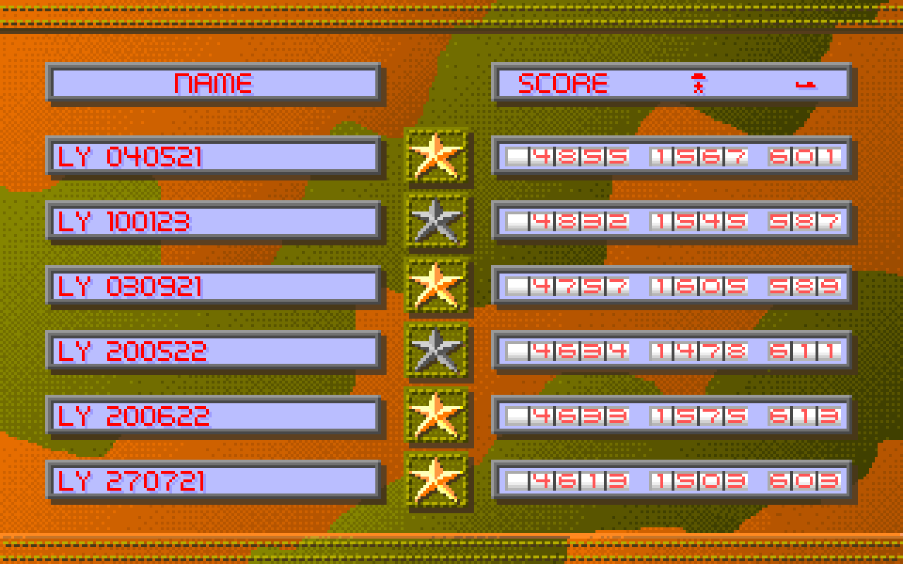

# Night Raid Reimplementation

A playable initial release with faithful and enhanced modes and known limitations,
not a claim of complete equivalence.

This repository contains a modern SDL reimplementation of Night Raid. It does
not distribute the original DOS program, `GRAPHICS.NTR`, `GRAPHICS.NRD`, or
extracted game assets.

## Why This Exists

This was my pa's favorite game. I still have his original high-score table:
six `LY` entries, with a best score of 4,855. I wanted to keep the game playable
on modern computers, and keep his high scores with it.

I started with a small frustration: pressing Space sometimes failed to fire
the cannon. The original samples fire only at fixed intervals, so a short
press between samples can be missed.

That investigation grew into a reverse-engineering and portable reimplementation
project. I used decompiled code, original assets, and comparisons against the
DOS game running in DOSBox-X to guide the work. I wanted to preserve its
behavior, not merely make something that looks similar.

I used my [DOS RE Harness](https://github.com/jckhng/dos-re-harness) to automate
Ghidra analysis, Unicorn checks of isolated original routines, and DOSBox-X
captures. Together, these tools let me recover the logic and compare game
state, pixels, and audio against the original. They are development tools,
not required to play OpenNightRaid.

Faithful mode preserves the recovered behavior, including the firing quirk.
Enhanced mode makes the game more comfortable on modern hardware, with buffered
fire input, smoother motion, gamepad controls, and additional visual effects.
Both modes read the player's original game archive directly.

## Comparisons



[Watch the full missed-fire comparison](docs/media/missed-fire-original-vs-enhanced.mp4).
Four short taps are missed in the original and faithful mode, but remembered
in enhanced mode. Holding Space works in all three. This clip is silent and
shown at 8x slow motion; the enhanced fix retains the original firing rate.

[](docs/media/night-raid-three-way-gameplay.mp4)

The gameplay comparison is 20 seconds at normal speed, with one faithful-build
soundtrack and no pitch/speed changes. All 1,400 faithful source frames match
the selected original pages; the two native simulations match for this route.
It is not a full-game certification or a recording of live 120 Hz interpolation.

## For My Pa

For my pa, whose favorite game was Night Raid.



His six `LY` entries are still in the original save, led by 4,855.
I have kept the original save private and unchanged. See
[the project story](docs/PROJECT_STORY.md) and
[comparison notes](docs/COMPARISON_NOTES.md).
Original game imagery/audio in these media are not covered by the source MIT grant.

## Two Modes

Windows release packages provide two executables:

- `night-raid-faithful.exe` preserves recovered DOS gameplay, timing, input,
  rendering, and scripted behavior as closely as practical.
- `night-raid-enhanced.exe` uses the same game simulation and user-supplied
  original archive, with smooth presentation, gamepad support, dynamic lighting,
  screen shake, persistent debris, and selected quality-of-life fixes.

Enhanced mode retains the fixed 70 Hz gameplay simulation while presenting
interpolated actor motion independently at 120 Hz. Presentation-only effects do
not alter simulation state or gameplay timing.
Both executables use the original flying-debris trajectories and fixed collision
boxes. Persistent debris and lighting are visual effects, not extra collision
actors.

## Requirements

- Windows 10 or later, x64
- Either the public four-level shareware `GRAPHICS.NRD` or a lawfully obtained
  registered `GRAPHICS.NTR`

The packaged executables and official SDL runtime do not require a separate
Visual C++ runtime installation. Source builds using a different SDL DLL may.

Only the complete registered data revision with SHA-256
`0fdc40e121bc28b88dfa7e767fedea0356d031c7efa6c1c426af714adf78ffe5`
is currently verified; other registered revisions are not promised to work.

The verified shareware `GRAPHICS.NRD` has SHA-256
`03faf8544961b94765cc01f8e72c232aed706bfd3b384ea7f1e67b5e0ec5decd`.
It is available as part of the complete original shareware package from the
[DOSGames.com Night Raid page](https://dosgames.com/game/night-raid/). It is not
bundled here. The runtime supports its original four levels and concludes the
level-4 milestone with the original dedicated shareware ending. Registered-only
levels and the registered finale require `GRAPHICS.NTR`.

## Quick Start

1. Extract this package.
2. Copy either `GRAPHICS.NRD` or `GRAPHICS.NTR` into `bin\windows-x64`, beside
   the two game executables.
3. Launch either executable.

The runtime validates and reads the selected graphics archive directly. It does
not invoke Python, extract loose files, modify the original archive, or execute
original DOS code. Normal launches read and write `CONFIG.NTR` beside the
executable, regardless of the working directory. Both modes share that file;
compatible original version-3 configurations can also be used there.

## Run Faithful Mode

```powershell
.\bin\windows-x64\night-raid-faithful.exe
```

## Run Enhanced Mode

```powershell
.\bin\windows-x64\night-raid-enhanced.exe
```

The original samples cannon fire only at its fixed firing gate, so a short
Space-bar tap between samples can be missed. Faithful mode preserves that
behavior. Enhanced mode buffers a new fire press until the next gate, while
retaining the original firing rate. It also requires the fire control to be
released after starting a game, advancing an intermission, or returning from
the control panel so a held button cannot produce an accidental shot.

Menu arrow taps respond immediately, and held arrows use keyboard repeat.
Enhanced mode does not impose a navigation cooldown between released taps.

Press `F12` in the enhanced executable to switch between Enhanced Presentation
and Original Presentation without restarting the game. Original Presentation
disables interpolation and enhanced visual effects, but retains enhanced input
behavior and other quality-of-life fixes. Both presentations retain the same
3x output size and window dimensions. Use the faithful executable for
the closest recovered original simulation and input behavior.

Both modes read the same user-supplied archive. The reimplementation does not
execute or load the original DOS executable. Configuration and high scores are
written to `CONFIG.NTR` beside the executable. If that file is absent, an older
`reimpl/save/CONFIG.NTR` beneath the executable directory is loaded; the next
successful save writes the adjacent file and leaves the older file untouched.

Normal launches do not search the source checkout or working directory for
archives or extracted assets. An explicit `--graphics-archive=<path>` selects
an archive elsewhere, and `--save-dir=<path>` overrides the save directory.
Bounded captures/headless diagnostics retain the working-directory-relative
`reimpl/save/CONFIG.NTR` default to keep harness saves isolated; use
`--save-dir` to select a different diagnostic save location.

## Credits

The original Night Raid was created by Argo Games and published by Software
Creations. The original game's design, artwork, music, and sounds belong to its
creators and rights holders.

OpenNightRaid is an unofficial reimplementation, not an Argo Games or Software
Creations release. Third-party code and font credits are listed in
[THIRD_PARTY_NOTICES.md](THIRD_PARTY_NOTICES.md).

## License

Project-authored reimplementation code and documentation are provided under
the MIT License. Original game files, extracted assets, captures, trademarks,
and separately licensed third-party components are excluded from that grant.
See `LICENSE`, `NOTICE.md`, and `THIRD_PARTY_NOTICES.md`.

## Build

See `BUILDING.md`. The complete reimplementation and vendored Nuked-OPL3
source are under `reimpl/`.

## Known Limitations

Some smart-bomb and overrun animation timing still differs. A recorded menu
option-cancel path returns to a different selection row, and audio has not been
proven sample-identical. Comparisons cover selected routes and scenes, not every
gameplay path or platform.

See [known issues](KNOWN_ISSUES.md) for details. This release does not claim
global pixel-perfect or complete behavioral equivalence.
